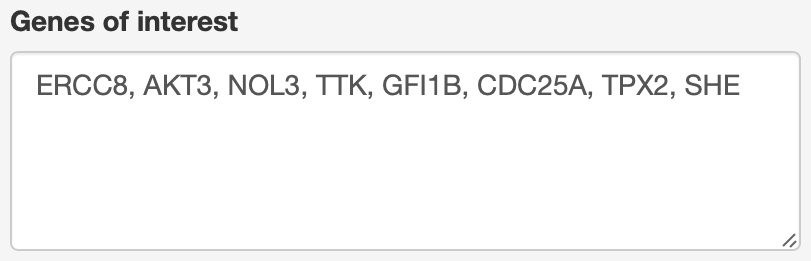
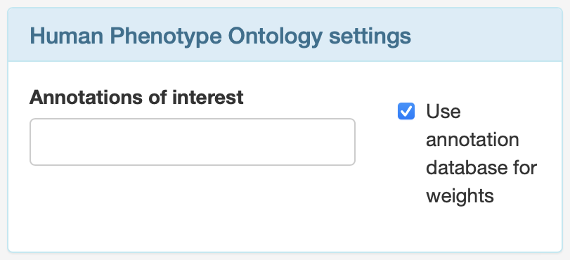
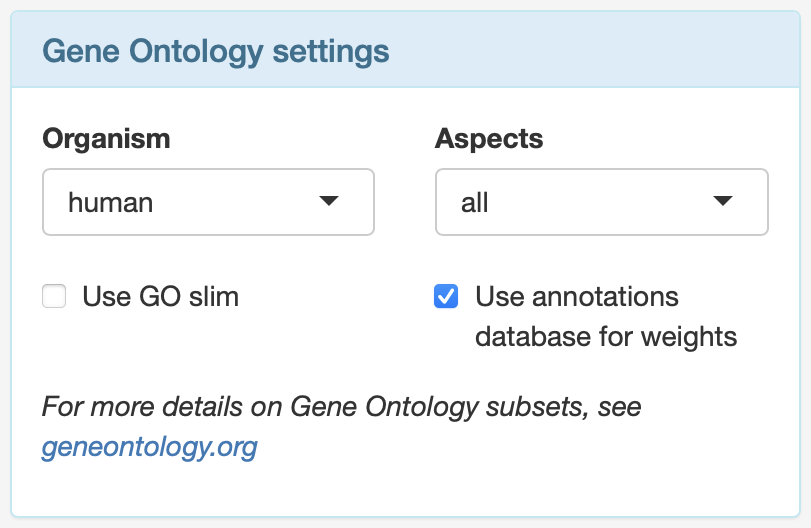
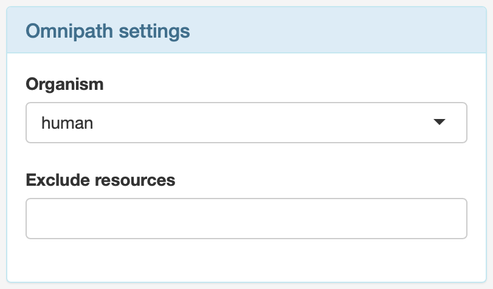
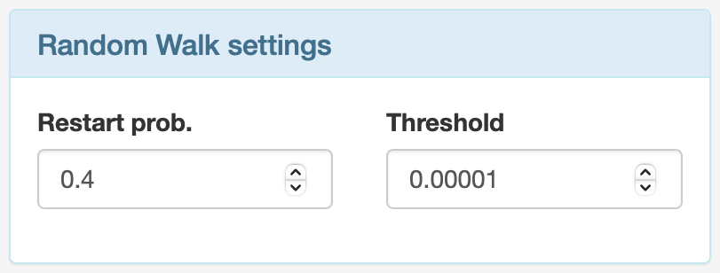
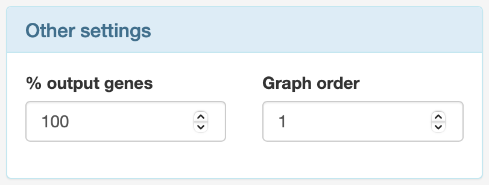
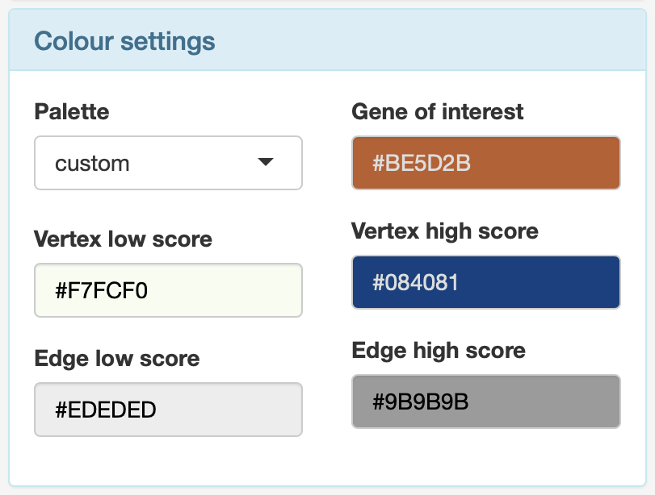
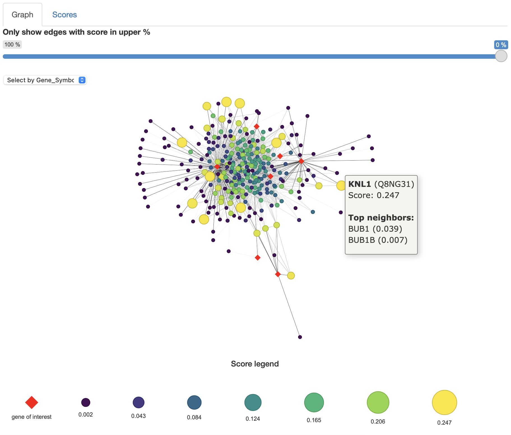
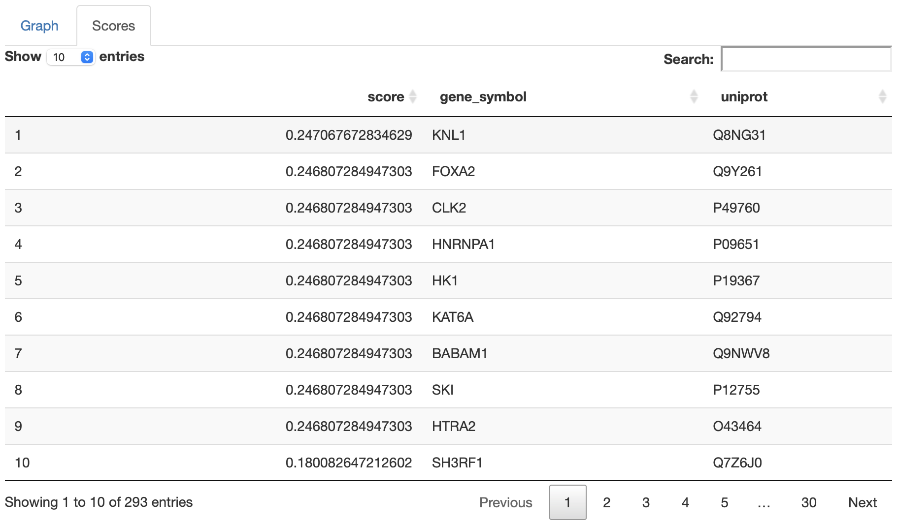

## 1. Introduction
[wppi](https://github.com/AnaGalhoz37/wppi) is a functional genome-phenotype gene prioritisation tool according to their potential relevance in a disease, based on Gene Ontology ([GO](http://geneontology.org)) and Human Phenotype Ontology ([HPO](https://hpo.jax.org/app/)) ontology databases. This Shiny application provides a user-friendly interface to compute ranked candidate genes and an interactive visualization of the underlying PPI network.

## 2. How to use

### 2.1 Enter genes
To score candidate genes, add a set of gene symbols (HGNC) to the “genes of interest” text field, separated by commas. Any number of genes works although a higher number leads to longer computation times.

There are several examples of different types of cancer (ovarian, pancreatic, thyroid, and bladder) available that need no extra computation. Selecting one will immediately load the corresponding visualisation and score table.

### 2.2 Tool settings

#### 2.2.1 Human Phenotype Ontology settings
`wppi` uses all annotations in the HPO database by default, both to construct the functionality and to weight the PPI network. This can be narrowed down here to any subset of annotations, while unchecking the *Use annotations database for weights* will set all weights to be equal.

#### 2.2.2 Gene Ontology settings
Just like with HPO, `wppi` defaults to use the entire GO database for human organisms using all three gene ontology aspects. Checking *Use GO slim* reveals a list of available subsets (slims) to choose from, while unchecking *Use annotations database for weights* will again make all network weights equal. Please be aware that using a GO slim requires building it first which might take a while.

#### 2.2.3 Omnipath settings
The PPI networks `wppi` uses are obtained from [OmniPath](https://omnipathdb.org/) which likewise comes with different organisms and resources to choose from. For more information, see [omnipath.org/interactions](https://omnipath.org/interactions)

#### 2.2.4 Random walk settings
The new candidate genes are scored by a Random Walk with Restart algorithm on the calculated weighted PPI network. Two of its parameters, the restart probability parameter and the threshold parameter, can be
customised here.

#### 2.2.5 Other settings
In some cases there can be a lot of candidate genes in the network returned. In order to shrink the resulting network, the percentage of the total candidate genes can be reduced. In other cases it can be of interest to widen the neighbourhood range/graph order that is counted as steps from the genes of interest, which can be done here.

#### 2.2.6 Colour settings
The colours of the visualization are fully customisable. There are several pre-set palettes that are also available in the `score_candidate_genes_from_PPI` and `visualize_graph` functions of the `wppi` package. If a custom palette is chosen the app will create a gradient between the supplied colours for vertices and edges, either as HEX code or picked directly from the colour picker that appears after clicking one of the fields. 

### 2.3 Graph

The scored candidate genes and the entered genes of interest are visualised as an interactive graph. The vertices can be selected, moved around, and hovering over a vertex reveals more information about it, such as the gene it represents, its score and its top ranked neighbours with their respective scores. For very dense networks it can be useful to hide the edges between lower scoring candidate genes. The lower percentage threshold can be customised using the slider above the graph.

### 2.4 Scores

This table ranks all candidate genes, their [UniProt identifier](https://www.uniprot.org) and their scores.

### 2.5 Download results
The results can be downloaded in a **.zip** file which contains both the visualisation as an **.html** file and the ranked gene scores as a **.csv** file.